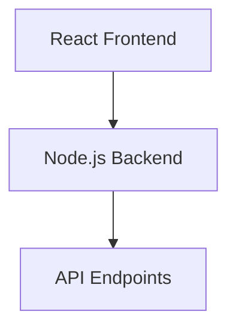

# velvet-app

Velvet - Neurodivergent AI Assistant

# 

<div align="center">

🌊 Welcome to Velvet - Your Neurodivergent AI Assistant 🌊

</div>

## 🛠️ Tech Stack

<div align="center">


</div>

## 📊 GitHub Stats

<div align="center">

<a href="https://github.com/Fayeq-qamar/velvet-app">
  
</a>
<a href="https://komarev.com/ghpvc/?username=Fayeq-qamar&color=blue">
  
</a>

</div>

## 🚀 Features

<table align="center">
  <tr>
    <td align="center" width="33%">
      
      <br/>
      <strong>AI-Powered Insights</strong>
      <p>Get personalized insights and recommendations.</p>
    </td>
    <td align="center" width="33%">
      
      <br/>
      <strong>Voice Recognition</strong>
      <p>Interact with the assistant using voice commands.</p>
    </td>
    <td align="center" width="33%">
      
      <br/>
      <strong>Real-Time Updates</strong>
      <p>Stay updated with real-time notifications.</p>
    </td>
  </tr>
</table>

## 🏗️ Architecture

<div align="center">



</div>

## 📦 Installation

<div align="center">

```bash

# Clone the repository
git clone https://github.com/Fayeq-qamar/velvet-app.git

# Navigate to the directory
cd velvet-app

# Install dependencies
npm install

# Start the application
npm start
```

</div>

## 🎯 Quick Start / Usage

1. Clone the repository.
2. Install the dependencies.
3. Start the application.
4. Open your browser and navigate to `http://localhost:3000`.
5. Enjoy using Velvet!

### Usage Example

```javascript
import { Assistant } from 'velvet-app';

const assistant = new Assistant();
assistant.start();
```

## 🤝 Contributing

We welcome contributions! Please read our [CONTRIBUTING.md](CONTRIBUTING.md) for guidelines on how to contribute to this project.

## 📝 License

This project is licensed under the MIT License. See the [LICENSE](LICENSE) file for more information.

<div align="center">


</div>
```

