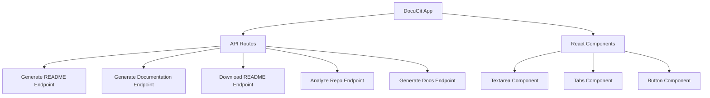

# DocuGit

A modern application built with cutting-edge technologies to analyse repositories and deliver Readme files and detailed documentations! (this was also created by Docu-git. XD)

# DocuGit

<div align="center">

The ultimate AI-powered README generator for GitHub projects!

<br/><br/>


<br/><br/>

</div>

## 🛠️ Tech Stack

<div align="center">


<br/><br/>


<br/><br/>

</div>

## 📊 GitHub Stats

<div align="center">

<a href="https://github.com/Fayeq-qamar/DocuGit">
  
</a>


<br/><br/>

</div>

## 🚀 Features

<div align="center">

<table>
  <tr>
    <td align="center" width="33%" style="background: #1a1a1a; border: 2px solid #8B5FBF; border-radius: 10px; padding: 20px;">
      
      <br/><br/>
      <strong>🧠 AI-Powered Generation</strong>
      <br/>
      <p>Automatically creates stylish README files tailored to your project.</p>
    </td>
    <td align="center" width="33%" style="background: #1a1a1a; border: 2px solid #E91E63; border-radius: 10px; padding: 20px;">
      
      <br/><br/>
      <strong>🚀 Quick Setup</strong>
      <br/>
      <p>Fast installation and easy usage with minimal configuration.</p>
    </td>
    <td align="center" width="33%" style="background: #1a1a1a; border: 2px solid #9C27B0; border-radius: 10px; padding: 20px;">
      
      <br/><br/>
      <strong>💻 Code Analysis</strong>
      <br/>
      <p>Deep analysis of your repository to optimize README content.</p>
    </td>
  </tr>
</table>

<br/><br/>

</div>

## 🏗️ Architecture

<div align="center">



<br/><br/>

</div>

## 🎯 Quick Start

<div align="center">

<table>
  <tr>
    <th width="50%" style="background: #1a1a1a; border: 2px solid #8B5FBF; padding: 15px;">
      <h3>🛠️ Development Mode</h3>
    </th>
    <th width="50%" style="background: #1a1a1a; border: 2px solid #E91E63; padding: 15px;">
      <h3>🚀 Safe Mode</h3>
    </th>
  </tr>
  <tr>
    <td style="background: #0d1117; border: 2px solid #8B5FBF; padding: 15px;">

```bash
npm run dev
```

Run with hot reload
    </td>
    <td style="background: #0d1117; border: 2px solid #E91E63; padding: 15px;">

```bash
npm run dev:safe
```

Run with minimal modules for debugging
    </td>
  </tr>
</table>

<br/><br/>

</div>

## 📦 Installation

<div align="center">

```bash

# Clone the repository
git clone https://github.com/Fayeq-qamar/DocuGit.git

# Navigate to project directory
cd DocuGit

# Install dependencies
npm install

# Run the application
npm start
```

<br/><br/>

</div>

## 🔧 Key Components

<div align="center">

| Component | Technology | Purpose |
|-----------|-----------|---------|
| Readme Generator | TypeScript/OpenAI | AI-powered README generation |
| Repo Cloner | simple-git | Local repository cloning |
| Code Analyzer | Babel/AST Parser | Deep repository analysis |

<br/><br/>

</div>

## 🤝 Contributing

<div align="center">

We welcome contributions! Here's how:

1. Fork the repository
2. Create a feature branch
3. Make your changes
4. Submit a pull request

<br/><br/>

</div>

## 📝 License

<div align="center">

This project is licensed under the MIT License - see the [LICENSE](LICENSE) file for details.

<br/><br/>

</div>

<div align="center">


</div>
```

